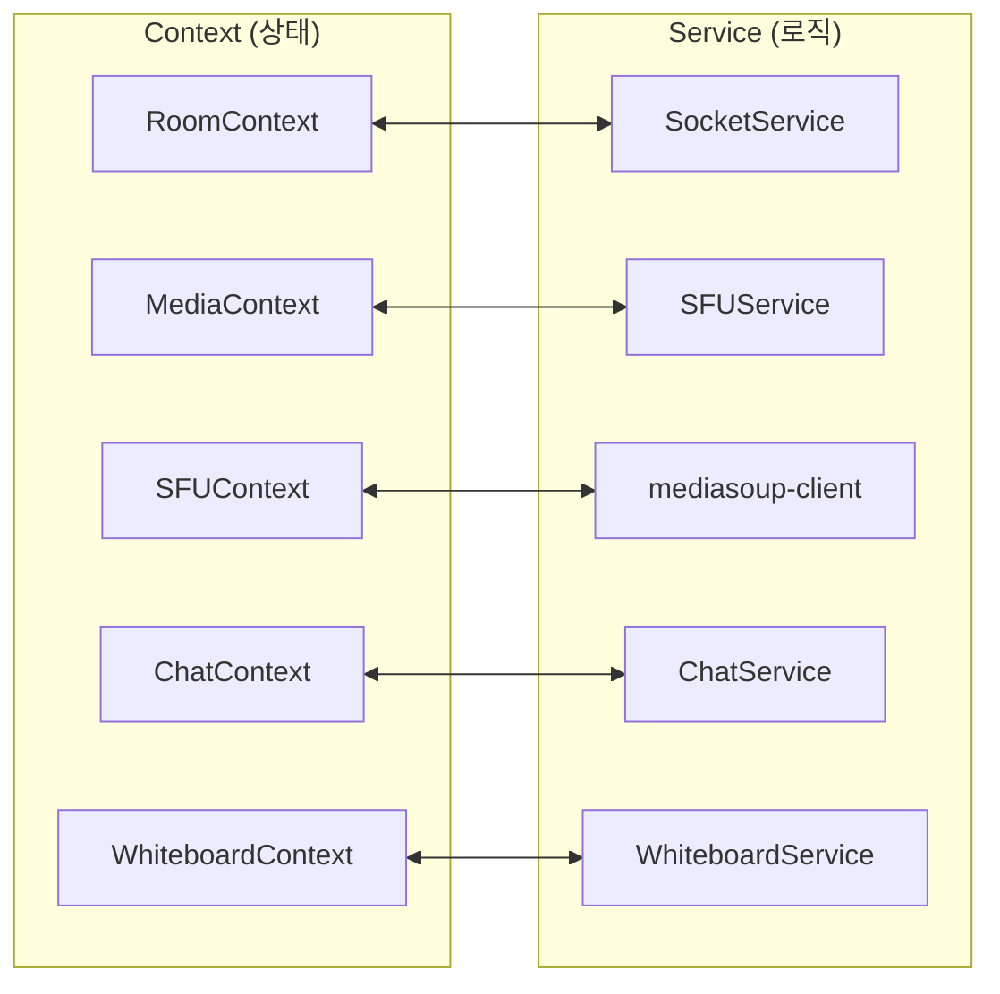
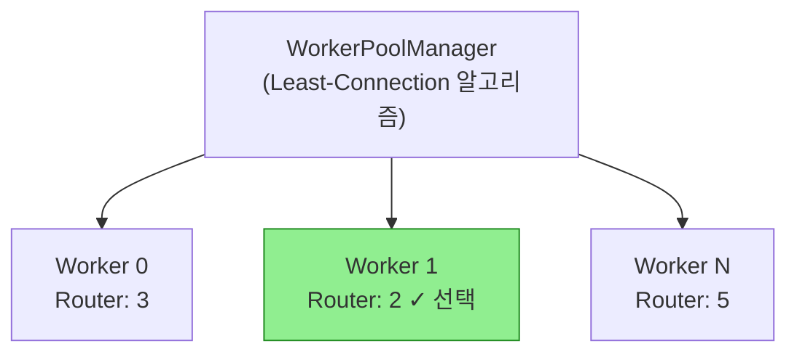

# WebRTC Real-time Collaboration

다중 사용자 실시간 화상 채팅 및 협업 화이트보드 웹 애플리케이션

## Features

- 👥 다중 사용자 화상/음성 통화 (SFU 아키텍처)
- 🖥️ 화면 공유
- 🎨 실시간 협업 화이트보드
- 💬 텍스트 채팅
- 🔒 회원가입 없이 즉시 사용
- ⚡ Mediasoup 기반 최적화된 미디어 라우팅

## Tech Stack

| 영역 | 기술 |
|------|------|
| Frontend | Next.js 16 (App Router), React 19 |
| Backend | Express + Socket.io |
| Media Server | Mediasoup (SFU) |
| UI | Tailwind CSS, shadcn/ui |
| Canvas | Fabric.js v6 |
| Validation | Zod |
| Code Quality | Biome, Jest |

## Project Structure

```root
├── app/                    # Next.js App Router pages
│   └── room/[roomId]/      # 동적 라우팅 (방 페이지)
├── components/
│   ├── chat/               # 채팅 UI 컴포넌트
│   ├── room/               # 화상 채팅 컴포넌트
│   ├── whiteboard/         # 화이트보드 컴포넌트
│   └── ui/                 # shadcn/ui 컴포넌트
├── contexts/               # React Context providers
│   └── media/              # MediaContext 분할 훅
├── services/               # 비즈니스 로직 (Service Layer)
│   └── sfu/                # SFU 관련 매니저
├── server/                 # Express 시그널링 서버
│   ├── handlers/           # Socket 이벤트 핸들러
│   ├── managers/           # 서버 상태 관리
│   │   └── mediasoup/      # Mediasoup 매니저
│   └── config/             # Mediasoup 설정
└── tests/
    └── load-test/          # 부하 테스트 도구
```

## Architecture

### Context-Service 패턴



Service는 Context에서만 인스턴스화됩니다.

### Mediasoup Worker Pool



**분배 알고리즘: Least-Connection**

- Router 카운트가 가장 적은 Worker에 새 Router 할당
- Worker별 Router 수 실시간 추적
- Worker 장애 시 자동 재생성 (운영 환경)

**WebRtcServer 모드:**

- 단일 포트 다중화 (기본): 포트 10000으로 모든 Transport 처리
- 포트 범위 모드: 10000-10200 범위 사용

## Getting Started

### Prerequisites

- Node.js 20+
- npm

### Installation

```bash
# 의존성 설치
npm install

# 환경 변수 설정
cp .env.local.local .env.local
```

### Development

두 개의 터미널에서 실행:

```bash
# 터미널 1: 프론트엔드 (포트 3000)
npm run dev

# 터미널 2: 시그널링 서버 (포트 3005)
npm run server:dev
```

[http://localhost:3000](http://localhost:3000)에서 애플리케이션 확인

**API 엔드포인트:**

- Health Check: `http://localhost:3005/health`
- SFU 상태: `http://localhost:3005/sfu/stats`
- SFU 메트릭: `http://localhost:3005/sfu/metrics`

### Environment Files

| 파일 | 용도 |
|------|------|
| `.env.local.local` | 로컬 개발 환경 |
| `.env.local.docker` | Docker 환경 |
| `.env.local.pinggy` | 외부 터널링 테스트 |

### Environment Variables

```env
# 서버 설정
PORT=3005
CORS_ORIGIN=http://localhost:3000

# 클라이언트 설정
NEXT_PUBLIC_SOCKET_URL=http://localhost:3005
NEXT_PUBLIC_STUN_SERVER=stun.l.google.com:19302

# Mediasoup 설정
MEDIASOUP_NUM_WORKERS=1                    # Worker 수 (기본: CPU 코어 수)
MEDIASOUP_WEBRTC_SERVER_ENABLED=true       # 단일 포트 다중화

# 모니터링
ENABLE_MONITORING=true
CPU_PROFILING_ENABLED=false                # CPU 프로파일링
TRAFFIC_LOG_DIR=./logs/traffic             # 트래픽 로그 경로
```

## Scripts

### Development

```bash
npm run dev           # 프론트엔드 개발 서버
npm run server:dev    # 시그널링 서버 (nodemon)
npm run dev:docker    # Docker 환경용 개발 서버
```

### Code Quality

```bash
npm run biome:check   # 린트 검사
npm run biome:fix     # 린트 자동 수정
npm run format        # 코드 포맷팅
```

### Testing

```bash
npm test              # 단위 테스트
npm run test:coverage # 커버리지 포함 테스트
npm run load-test     # 부하 테스트
```

### Build

```bash
npm run build         # 프로덕션 빌드
npm start             # 프로덕션 서버
```

## Code Quality

이 프로젝트는 **Biome**을 사용합니다:

- Line Ending: LF (Unix-style)
- Quote Style: Double quotes
- Indent: 2 spaces

설정 파일: `biome.json`, `.editorconfig`

## License

See LICENSE file for details.
